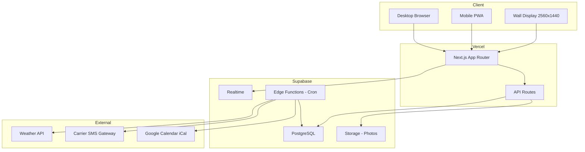

# MyFamily — Implementation Plan

## Architecture Overview

---

## Phase 1: Core MVP

### 1A — Project Scaffolding
- `npx create-next-app@latest myfamily` with App Router, TypeScript, Tailwind
- Install dependencies: `@supabase/supabase-js`, `@supabase/ssr`, `@tanstack/react-query`, `zustand`, `framer-motion`, `date-fns`
- Initialize shadcn/ui with `npx shadcn@latest init`
- Add shadcn components: button, dialog, input, select, checkbox, calendar, popover, sheet, tabs, toast
- Set up folder structure per spec Section 13
- Configure Supabase client (`lib/supabase/client.ts` and `server.ts`)
- Set up TanStack Query provider and Zustand store shell

### 1B — Design System
- Create `styles/tokens.css` with all seasonal CSS custom properties from spec Section 5.2
- Implement `lib/utils/season.ts` — auto-detect season from date, apply correct token set
- Configure `tailwind.config.ts` to reference CSS variables for colors
- Load Google Fonts: Playfair Display, Cormorant Garamond, Nunito, JetBrains Mono
- Define responsive breakpoints including `wall: 2560px`
- Build `UserAvatar` component — colored circle with initial

### 1C — Supabase Setup
- Create Supabase project
- Write migration `001_initial_schema.sql` with all tables from spec Section 6
- Enable Realtime on: events, todos, chores, chore_completions, grocery_items, must_have_completions, affirmations, photos
- Create RLS policies scoped to `family_id`
- Write `seed.sql` with a sample family + 3 users + sample events
- Generate TypeScript types from schema

### 1D — User Management
- Settings page with user list
- Add user form: name, phone, carrier, avatar_color
- Edit/delete user
- `useUsers` hook with TanStack Query + Realtime subscription
- `TabBar` component showing user tabs on wall, bottom nav on mobile

### 1E — Calendar
- `CalendarGrid` — week view with 7 columns, time slots as rows
- `MonthView` — traditional month grid
- `DayTimeline` — vertical time-block view for single day
- `EventCard` — colored block with title, time, user dot
- `EventForm` — touch-optimized modal/sheet for create/edit
- `FilterBar` — user color dots to toggle visibility
- `useEvents` hook with CRUD + Realtime
- Views: day, week, month, agenda

### 1F — Recurring Events
- `lib/utils/recurrence.ts` — generate instances for next 30 days
- Support: daily, weekly, biweekly, monthly, yearly
- `recurrence_parent_id` linkage for generated instances
- API route or edge function to generate on schedule

### 1G — Wall Display Layout
- `WallLayout.tsx` — full 2560x1440 grid layout, no scrolling
- Top: tab bar with family + user tabs
- Left 70%: hero area + weekly calendar grid
- Right 30%: weather widget + todays chores + grocery list
- Bottom strip: photo carousel (optional)
- Min font sizes: 48px hero, 28px headings, 20px events, 16px body
- Min touch targets: 56x56px
- Media query: `@media (min-width: 2560px)` or container-based detection

### 1H — Mobile Layout
- `MobileLayout.tsx` — bottom tab bar navigation
- Tabs: Calendar, Tasks, Groceries, Photos, Me
- Compact month calendar with today highlight
- Today's events list below calendar
- Quick action buttons for adding items
- Pull-to-refresh with Realtime sync
- Min touch targets: 44x44px

### 1I — Deploy
- Connect GitHub repo to Vercel
- Set environment variables: `NEXT_PUBLIC_SUPABASE_URL`, `NEXT_PUBLIC_SUPABASE_ANON_KEY`
- Deploy and verify on mobile + desktop
- SSH into Pi, update `kiosk.sh` URL, reboot

---

## Phase 2: Full Feature Set

### 2A — To-Do List
- `TodoList` and `TodoItem` components
- Priority flags: high/medium/low with color coding
- Filter by user, priority, tag
- Sort by priority, due date, created date
- Swipe-to-complete on mobile
- Collapsible "Done" section
- Wall display: sidebar widget showing top 5-8 items

### 2B — Chore System
- `ChoreBoard` and `ChoreCard` components
- Recurrence: daily/weekly/biweekly/monthly with day-of-week selection
- Completion tracking via `chore_completions` table
- Today's chores highlighted on family dashboard
- Per-user chore view in user tabs

### 2C — Must-Haves
- `MustHaveChecklist` with progress ring
- Three cadences: daily, weekly, monthly
- Auto-reset: daily at midnight, weekly Monday, monthly 1st
- Personal to each user, shown in user tab
- Edge function for reset logic

### 2D — Grocery List
- `GroceryList` and `GroceryItem` components
- Category grouping: produce, dairy, meat, pantry, frozen, other
- Real-time sync across all devices
- Check off items while shopping
- Clear completed / clear all with confirmation
- Compact widget on wall, full list on mobile

### 2E — Weather Widget
- `WeatherWidget` component
- API route `/api/weather` with 30-min cache
- Current conditions + 5-day forecast
- Wall: persistent top-right widget
- Mobile: compact card above calendar
- Location configured in family settings

### 2F — Affirmations
- `AffirmationHero` component with serif typography
- Family-wide and per-user affirmation pools
- Daily rotation through pool
- Pin option for specific affirmations
- Subtle entrance animation

### 2G — Photos
- `PhotoCarousel` with crossfade, 10s interval
- `PhotoUpload` — mobile camera roll or drag-drop on web
- Supabase Storage with image resize on upload
- Scope: family or personal
- Wall: hero carousel on family tab, personal hero on user tabs
- Screensaver mode: full-screen slideshow after configurable idle

### 2H — User Personalization
- Per-user accent color picker
- Hero image upload for user tab
- Personal affirmation setting
- Background customization

---

## Phase 3: Notifications and Polish

### 3A — SMS Notifications
- Edge function `send-reminders` running every 5 min
- Carrier email-to-SMS gateway map
- Event reminders at configured lead time
- Chore reminders in the morning
- Duplicate prevention tracking
- Manual nudge sending between users

### 3B — Google Calendar iCal Import
- Settings UI for iCal URL per user
- Edge function fetches/parses iCal every 15 min
- Imported events marked read-only with Google icon
- Displayed alongside native events

### 3C — PWA + Screensaver
- `manifest.json` for iOS home screen install
- Service worker for offline caching
- Screensaver: full-screen photo slideshow after idle timeout
- Configurable timeout in settings

### 3D — Animation Polish
- Framer Motion page transitions between tabs
- Card press scale animation
- Checkbox bounce animation
- Photo carousel crossfade
- Skeleton loading screens
- Haptic feedback via Vibration API

### 3E — Performance
- Image optimization with `next/image`
- Service worker with 24hr stale-while-revalidate cache
- Offline indicator when disconnected
- Target: FCP < 1.5s, TTI < 3s, wall render < 2s

---

## Key Technical Decisions

| Decision | Choice | Rationale |
|----------|--------|-----------|
| Layout detection | CSS media queries + JS `useMediaQuery` hook | Wall display gets `min-width: 2560px` breakpoint; also detect via user-agent or URL param as fallback |
| State management | TanStack Query for server state, Zustand for UI state | Clean separation; TanStack handles caching and revalidation |
| Realtime | Supabase Realtime subscriptions in custom hooks | Each `use*` hook subscribes to its table for live updates |
| Routing | Single page app with tab-based navigation, no URL routing for tabs | Wall display stays on one page; mobile uses bottom tabs as view switchers |
| Forms | shadcn Dialog/Sheet with react-hook-form | Touch-friendly modals on mobile, inline panels on wall |
| Date handling | date-fns | Lightweight, tree-shakeable, good recurrence support |

---

## Getting Started

Switch to **Code** mode to begin Phase 1A: project scaffolding.
