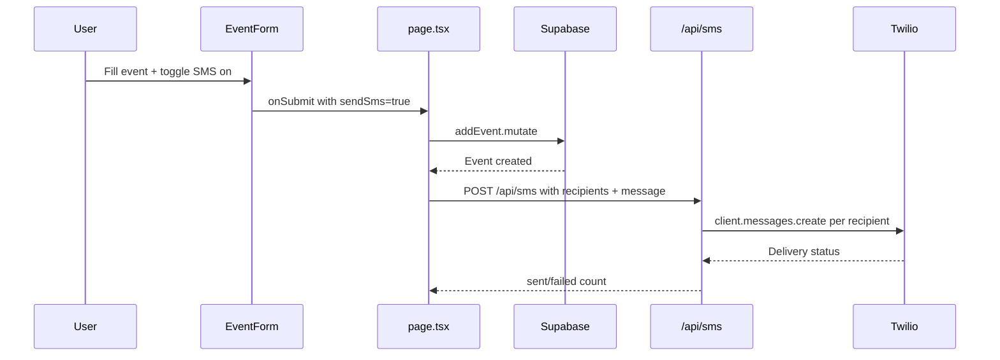

# SMS Text Notification Feature — Implementation Plan

## Overview

Add a "Send text notification" toggle to the EventForm. When enabled and the event is saved, send SMS via Twilio to all tagged users who have phone numbers. Show inline warnings for users missing phone numbers.

## Current State

- **[`User`](src/types/index.ts:11)** already has `phone_number: string | null` and `carrier: string | null` — **no type changes needed**
- **[`UserManagement`](src/components/settings/UserManagement.tsx:175)** already has phone number and carrier fields in [`UserFormFields`](src/components/settings/UserManagement.tsx:175) — **no settings UI changes needed**
- **[`EventForm`](src/components/calendar/EventForm.tsx:122)** has user tag buttons and a "Family" toggle — needs SMS toggle + missing-phone badges
- **[`/api/notify/route.ts`](src/app/api/notify/route.ts:1)** currently proxies to a Supabase edge function — needs a new SMS endpoint or refactor
- **[`useEvents`](src/lib/hooks/useEvents.ts:48)** `addEvent` / `updateEvent` mutations — need to call SMS API after save

---

## File-by-File Changes

### 1. `src/app/api/sms/route.ts` — **NEW FILE**

Create a dedicated SMS API route using Twilio:

```typescript
import { NextResponse } from 'next/server';
import twilio from 'twilio';

export async function POST(request: Request) {
  try {
    const { recipients, message } = await request.json();
    // recipients: Array<{ name: string; phone_number: string }>
    // message: string (e.g. "New event: Soccer Practice on 03/15/2026 at 3:00 PM")

    const accountSid = process.env.TWILIO_ACCOUNT_SID;
    const authToken = process.env.TWILIO_AUTH_TOKEN;
    const fromNumber = process.env.TWILIO_PHONE_NUMBER;

    if (!accountSid || !authToken || !fromNumber) {
      return NextResponse.json({ error: 'Twilio not configured' }, { status: 500 });
    }

    const client = twilio(accountSid, authToken);

    const results = await Promise.allSettled(
      recipients.map((r: { phone_number: string }) =>
        client.messages.create({
          body: message,
          from: fromNumber,
          to: r.phone_number,
        })
      )
    );

    const sent = results.filter((r) => r.status === 'fulfilled').length;
    const failed = results.filter((r) => r.status === 'rejected').length;

    return NextResponse.json({ sent, failed });
  } catch (error) {
    return NextResponse.json({ error: 'Failed to send SMS' }, { status: 500 });
  }
}
```

### 2. `src/components/calendar/EventForm.tsx` — **MODIFY**

#### 2a. Add state for SMS toggle

At [line ~134](src/components/calendar/EventForm.tsx:134), add:

```typescript
const [sendSms, setSendSms] = useState(false);
```

#### 2b. Add `sendSms` to `EventFormData` interface

At [line ~9](src/components/calendar/EventForm.tsx:9), add `sendSms: boolean` to the interface:

```typescript
interface EventFormData {
  title: string;
  date: string;
  start_time: string | null;
  end_time: string | null;
  all_day: boolean;
  recurrence: 'none' | 'daily' | 'weekly' | 'biweekly' | 'monthly' | 'yearly';
  userIds: string[];
  isFamily: boolean;
  sendSms: boolean;  // NEW
}
```

#### 2c. Pass `sendSms` in `handleSubmit`

At [line ~149](src/components/calendar/EventForm.tsx:149), add `sendSms` to the submitted data:

```typescript
onSubmit({
  // ...existing fields...
  sendSms,
});
```

#### 2d. Rearrange UI: Tags + User pills ABOVE SMS toggle

Move the "Tags" section (Family button) and "Assign to" section so they appear **before** the new SMS toggle. The current order at [lines 283–327](src/components/calendar/EventForm.tsx:283) stays in place; the SMS toggle is inserted **after** the user assignment section (after line 327) and **before** the Submit button.

#### 2e. Add SMS toggle UI (after user tags, before submit)

Insert between [line 327](src/components/calendar/EventForm.tsx:327) and [line 329](src/components/calendar/EventForm.tsx:329):

```tsx
{/* SMS Notification Toggle */}
{(isFamily || selectedUserIds.length > 0) && (
  <div className="space-y-2">
    <label className="flex items-center justify-between gap-3 cursor-pointer px-4 py-3 rounded-xl bg-bg-secondary border border-border">
      <div className="flex items-center gap-2">
        <svg xmlns="http://www.w3.org/2000/svg" width="16" height="16" viewBox="0 0 24 24" fill="none" stroke="currentColor" strokeWidth="2" strokeLinecap="round" strokeLinejoin="round" className="text-accent-primary"><path d="M22 16.92v3a2 2 0 0 1-2.18 2 19.79 19.79 0 0 1-8.63-3.07 19.5 19.5 0 0 1-6-6 19.79 19.79 0 0 1-3.07-8.67A2 2 0 0 1 4.11 2h3a2 2 0 0 1 2 1.72 12.84 12.84 0 0 0 .7 2.81 2 2 0 0 1-.45 2.11L8.09 9.91a16 16 0 0 0 6 6l1.27-1.27a2 2 0 0 1 2.11-.45 12.84 12.84 0 0 0 2.81.7A2 2 0 0 1 22 16.92z"/></svg>
        <span className="font-body text-sm text-text-primary font-medium">Send text notification</span>
      </div>
      <div
        onClick={() => setSendSms(!sendSms)}
        className={`relative w-11 h-6 rounded-full transition-colors ${sendSms ? 'bg-accent-primary' : 'bg-border'}`}
      >
        <motion.div
          animate={{ x: sendSms ? 20 : 2 }}
          className="absolute top-1 w-4 h-4 rounded-full bg-white shadow-sm"
        />
      </div>
    </label>

    {/* Missing phone number warnings */}
    {sendSms && (() => {
      const taggedUsers = isFamily ? users : users.filter(u => selectedUserIds.includes(u.id));
      const missingPhone = taggedUsers.filter(u => !u.phone_number);
      if (missingPhone.length === 0) return null;
      return (
        <div className="flex flex-wrap gap-1.5 px-1">
          {missingPhone.map(u => (
            <span
              key={u.id}
              className="inline-flex items-center gap-1 px-2.5 py-1 rounded-lg text-xs font-body font-medium bg-amber-500/10 text-amber-600 border border-amber-500/20"
            >
              <svg xmlns="http://www.w3.org/2000/svg" width="12" height="12" viewBox="0 0 24 24" fill="none" stroke="currentColor" strokeWidth="2" strokeLinecap="round" strokeLinejoin="round"><path d="m21.73 18-8-14a2 2 0 0 0-3.48 0l-8 14A2 2 0 0 0 4 21h16a2 2 0 0 0 1.73-3Z"/><line x1="12" x2="12" y1="9" y2="13"/><line x1="12" x2="12.01" y1="17" y2="17"/></svg>
              {u.name} — no phone
            </span>
          ))}
        </div>
      );
    })()}
  </div>
)}
```

### 3. `src/app/page.tsx` — **MODIFY**

In the event submit handler (where `addEvent.mutate` / `updateEvent.mutate` is called), add SMS dispatch logic after the mutation succeeds. The pattern:

```typescript
// Inside the onSubmit callback passed to EventForm:
const handleEventSubmit = async (data: EventFormData) => {
  // ... existing addEvent.mutate or updateEvent.mutate call ...

  if (data.sendSms) {
    const taggedUsers = data.isFamily
      ? users.filter(u => u.phone_number)
      : users.filter(u => data.userIds.includes(u.id) && u.phone_number);

    if (taggedUsers.length > 0) {
      const timeStr = data.all_day
        ? 'All day'
        : data.start_time
          ? formatDisplay(data.start_time)
          : '';

      await fetch('/api/sms', {
        method: 'POST',
        headers: { 'Content-Type': 'application/json' },
        body: JSON.stringify({
          recipients: taggedUsers.map(u => ({ name: u.name, phone_number: u.phone_number })),
          message: `📅 ${data.title} — ${format(new Date(data.date + 'T00:00:00'), 'MMM d, yyyy')}${timeStr ? ` at ${timeStr}` : ''}`,
        }),
      });
    }
  }
};
```

### 4. `package.json` — **MODIFY**

Add Twilio SDK dependency:

```bash
npm install twilio
```

### 5. `.env.local` — **MODIFY** (add variables)

```env
TWILIO_ACCOUNT_SID=your_account_sid
TWILIO_AUTH_TOKEN=your_auth_token
TWILIO_PHONE_NUMBER=+1XXXXXXXXXX
```

---

## Implementation Order

1. Install `twilio` package
2. Create [`src/app/api/sms/route.ts`](src/app/api/sms/route.ts) — Twilio SMS endpoint
3. Modify [`EventFormData`](src/components/calendar/EventForm.tsx:9) interface — add `sendSms` field
4. Modify [`EventForm`](src/components/calendar/EventForm.tsx:122) component — add toggle UI + missing phone badges
5. Modify [`src/app/page.tsx`](src/app/page.tsx:1) — wire up SMS dispatch in event submit handler
6. Add env vars to `.env.local` and Vercel dashboard
7. Test end-to-end: create event → tag users → toggle SMS → verify delivery

---

## Architecture Diagram



## Key Design Decisions

- **Separate `/api/sms` route** instead of modifying existing `/api/notify` — keeps concerns clean; the existing route handles Supabase-based reminders
- **SMS fires client-side after mutation success** — simple, no need for database triggers or queues for v1
- **No `carrier` field used for Twilio** — Twilio handles carrier routing; the existing carrier field is legacy from email-to-SMS gateway approach and can be deprecated later
- **Toggle only visible when users are tagged** — prevents confusion; no point showing SMS toggle with zero recipients
- **Amber warning badges** — non-blocking; user can still save the event, only users with phone numbers receive SMS
